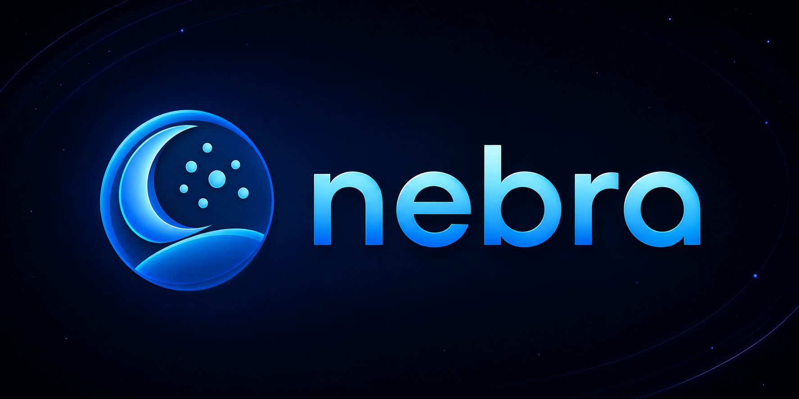

<p align="center">
  <a href="https://nebra-lang.github.io">
    
  </a>
</p>

<p align="center">
  <strong>A typed superset of Lua that compiles to clean, portable Lua.</strong>
</p>

<p align="center">
  <a href="https://nebra-lang.github.io"><b>Documentation</b></a> &bull;
  <a href="https://nebra-lang.github.io/docs/getting-started/installation">Install</a> &bull;
  <a href="https://nebra-lang.github.io/docs/examples/overview">Examples</a> &bull;
  <a href="https://github.com/nebra-lang/nebra">Compiler</a>
</p>

---

Lua is small, fast and embeddable. It is also easy to outgrow: no static types, no
module discipline, no class story. Nebra adds the structure without taking you off Lua.

Types are optional, everything is lowered at compile time, and the output is Lua you
would have been happy to write by hand. There is no runtime library to ship.

```lua
class Greeter
    name: string

    constructor(name: string)
        self.name = name
    end

    function greet(): string
        return "Hello, " .. self.name .. "!"
    end
end

local greeter = new Greeter("world")
print(greeter:greet())
```

That compiles to this, and nothing else:

```lua
local Greeter = {}
Greeter.__index = Greeter
Greeter.__name = "Greeter"
function Greeter.new(name)
	return setmetatable({
		name = name
	}, Greeter)
end
function Greeter:greet()
	return "Hello, " .. self.name .. "!"
end
local greeter = Greeter.new("world")
print(greeter:greet())
```

## Get started

```bash
curl -fsSL https://raw.githubusercontent.com/nebra-lang/nebra/master/scripts/install.sh | bash

nebra init
nebra run
```

Windows users run the PowerShell one-liner instead. The
[installation guide](https://nebra-lang.github.io/docs/getting-started/installation)
covers every platform, plus manual downloads and building from source.

## What is in the box

One self-contained binary carries the compiler, the language server, a package
manager, a test runner, a REPL, a docs generator, a native bundler, and an embedded
Lua 5.4 interpreter. Targets Lua 5.1 through 5.4 and LuaJIT.

## Repositories

| Repository | What it is |
|------------|------------|
| [nebra](https://github.com/nebra-lang/nebra) | The compiler, toolchain and language server |
| [nebra-lang.github.io](https://github.com/nebra-lang/nebra-lang.github.io) | The documentation site |
| [pm-registry](https://github.com/nebra-lang/pm-registry) | Package alias registry for `nebra add` |
| [nanos-world-types](https://github.com/nebra-lang/nanos-world-types) | Type declarations for the nanos world sandbox |
| [fivem-types](https://github.com/nebra-lang/fivem-types) | Type declarations for the FiveM native API |
| [nanos-world-deathmatch](https://github.com/nebra-lang/nanos-world-deathmatch) | Example gamemode ported to Nebra |

## Coming from Lux

Nebra was called Lux until the name collided with
[lumen-oss/lux](https://github.com/lumen-oss/lux), a Lua package manager that uses the
same `lux.toml` and `lux.lock` file names. Existing projects convert in one command:

```bash
nebra migrate --dry-run   # show what would change
nebra migrate             # rename files and rewrite the matching tokens
```
